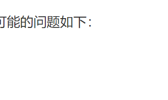

目标：

- 理解数据双向绑定的原理
- 在面试时，高分通过面试官对vue中mvvm的面试题。可能的问题如下：
  - 你是如何理解mvvm的？
  - 你知道vue的响应式原理吗？
  - 你能说下你是如何理解数据双向绑定的吗？

产出：

- 手写一个基本的Vue数据双向绑定的功能。

知识点：

- [掌握] Object.defineProperty。就是js中提供一个API,它用来定义或者修改对象的属性，它是vue2.X的核心基础（如果没有Object.defineProperty就没有Vue2.X）。
- [掌握] 观察者模式。23设计模式中的一种，非常常见的设计模式。
- [拓展] Proxy（代理，它是es6中新补充的一构造器，它的功能与Object.defineProperty相似，但是更加强大。vue 3.X 版本将会使用它来替换Object.defineProperty ）