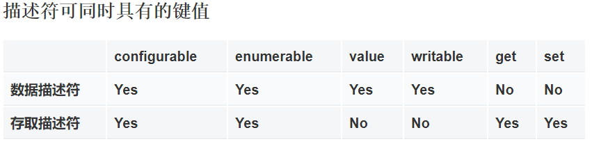

Object.defineProperty()

在vue2.x系列中，双向数据绑定的核心就是这个方法。

## Object.defineProperty

> `Object.defineProperty()` 方法会直接在一个对象上定义一个新属性、或者修改一个对象的现有属性， 并返回这个对象。

给对象添加属性的方式有：

- 字面量

  ```javascript
  var obj = {
      a: 1,
      b: 2 
  }
  ```

- 对象.属性名 = 值

  ```javascript
  obj.a  = 1;
  ```

- 对象["属性名"] = 值

  ```javascript
  obj["a"] = 1
  ```

上面的方式都是我们学习过的，现在新多出一种来。

- Object.defineProperty()

## 格式

Object.defineProperty()

- 格式

```
Object.defineProperty(obj, prop, descriptor)
```

- 参数
  - `obj`:要在其上定义属性的对象。
  - `prop`:要定义或修改的属性的名称。
  - `descriptor`:对参数2的描述，也叫属性描述符。

- 返回值

  被传递给函数的对象。

## 属性描述符

```javascript
Object.defineProperty(对象, 属性名,{
    configurable:false, // 可配置
    enumerable:false,   // 可枚举
    
    writable:false,     // 可写入
    value:undefined,    // 初始值
    
    get:function(){}, // 重点 
    set:function(){}  // 重点
    
})
```

说明

- `configurable`： 为 true 时，属性才能重新被定义（再写一次Object.defineProperty）。**默认为 false**。
- `enumerable`：为`true`时，该属性才能够出现在对象的枚举属性中，即可以使用for in循环访问。**默认为 false**。

- `value`：该属性对应的初值。可以是任何有效的 JavaScript 值（数值，对象，函数等）。**默认为 [`undefined`](https://developer.mozilla.org/zh-CN/docs/Web/JavaScript/Reference/Global_Objects/undefined)**。
- `writable`：为`true`时，value属性值才能被修改。**默认为 false**，相当是只读的。

- `get`：一个给属性提供 get的方法，如果没有 getter 则为 `undefined`。当访问该属性时，该方法会被执行。**默认为 [`undefined`](https://developer.mozilla.org/zh-CN/docs/Web/JavaScript/Reference/Global_Objects/undefined)**。
- `set`：一个给属性提供 set 的方法，如果没有 setter 则为 `undefined`。当属性值修改时，触发执行该方法。该方法将接受唯一参数，即该属性新的参数值。**默认为 [`undefined`](https://developer.mozilla.org/zh-CN/docs/Web/JavaScript/Reference/Global_Objects/undefined)**。

>  如果一个描述符同时有(value或writable)和(get或set)关键字，将会产生一个异常。




## 学习属性描述符

### enumerable :可枚举的

```javascript
// 对象
var obj = {
    b:1
}
// 添加新属性
Object.defineProperty(obj,"a",{
    value:100, // 值
    enumerable:false // 不可枚举。不能被for in循环出来
})

Object.defineProperty(obj,"c",{
    value:200, // 值
    enumerable:true  // 可枚举。能被for in循环出来
})

console.dir(obj)


// 循环取出属性名。它只能取出 可枚举的属性名
// for(var 属性名 in 对象)
// 功能是：循环取出对象中的,可枚举的，所有属性名
for(var key in obj) {
    console.log(key)
}
```

结论：

enumerable只有为true，它才能被枚举(被for in循环）。

> for of是循环属性值，for in 是循环属性名

### configurable

可配置的。如果是false，则不能再次使用defineProperty去修改，修改就会报错。

也可以理解这个属性是`只读的`它不能被修改了。

```javascript
var obj = {}
// 定义属性
Object.defineProperty(obj,"c",{

    configurable: false, 
    // 如果这个值是false,说明这属性将不能再次使用defineProperty来修改
    // 如果再通过：obj.c = 200，则也不会生效。
    value:100 
})
// 对现有属性的修改
// Uncaught TypeError: Cannot redefine property: c
// Object.defineProperty(obj,"c",{
//     value:200 
// })

console.log(obj)
```


### value和writable

value:是属性初值

writeable: 可写入的

定义只读的属性:

```javascript
const obj = {
    B:1
}
Object.defineProperty(obj,"A",{
    value: 1,
    writable: false
})

console.dir(obj)
console.log(obj.A)
obj.A =1001
console.log(obj.A)
```

const定义的对象，它的属性还是可以修改的。我们可以通过writable设置为false来设置只读的属性，真正实现常量的效果。

在上面的代码中，如果给对象的属性赋值，并不会修改属性的值。

### 进阶：对已有对象进行封装，以得到一个常量对象

目标：写一个函数，传入对象1，返回对象2。要求对象2的属性都不能被修改。 

```javascript
const obj = {
    a:1,
    b:2
}
function getConst(obj){
    var _obj = {}
    for(var key in obj){
        Object.defineProperty(_obj,key,{
            writable:false,
            value: obj[key]
        })
    }
    return _obj
}
var obj1 = getConst(obj)

console.log("设置之后的值是：",obj1)
```


### get和set

get()当访问对象的属性时，它会执行；

set()当设置对象的属性时，它会执行；

- 它们与value和writable是互斥的（一个属性的属性描述符中， 不能同时有 `value和writable` g与 `get和set`）。
- 一旦使用它们，则这个属性就没有保存属性值的能力，如果希望它能保存属性性，则需要引入另一个额外的变量。
- 应用：它们来做拦截器


```javascript
var obj = {
        a:1
    }
    // 
    // Uncaught TypeError: Invalid property descriptor. 
    //  Cannot both specify accessors and a value or writable attribute

    // set get 不能与value和writeable同时存在 。


    // get,set 无法保存属性的值，只能借助另一个额外的变量

    // 需求，在你设置age属性时，如果属性>30岁，则统一改成28。
    var _age = 18
    Object.defineProperty(obj,'age',{
        get:function(){
            // obj.age ，则会执行get函数；
            // get()的返回值，就是obj.age的值
            // console.log('获取age属性')
            return _age
        },
        set(val){
            // obj.age = XX ，则会执行set函数，并且会传入值给val
            if(val > 30 ){
                console.log('程序员，30岁是一个劫')
                val = 28
            }
            _age = val
        }
    })

    console.log(obj);
    obj.age = 31;
    console.log(obj.age); // 28
```


#### 实现常量对象

目标：不允许修改对象的某个属性，修改了也无效。

第一步：使用get()返回值，定义只读的属性

第二步：使用set()，在设置值时报错。

```javascript
const obj = {}
Object.defineProperty(obj,"age",{
    get(){
        return 18
    },
    set(){
        console.warn("对不起，你没有权限设置age属性！")
        console.error("对不起，你没有权限设置age属性！")
        // throw new Error("对不起，你没有权限设置age属性！")
    }
})

console.dir(obj)
console.log(obj.age)
obj.age = 80
console.log("设置之后的值是：",obj.age)
```


### 进阶：对已有对象进行封装，以得到一个常量对象

- 思路：只设置get，不设置set

```javascript
const obj = {
    a:1,
    b:2
}
function getConst(obj){
    var _obj = {}
    for(var key in obj){
        Object.defineProperty(_obj,key,{
            get(){
                return obj[key]
            }
        })
    }
    console.log(key)
    return _obj
}
var obj1 = getConst(obj)

console.log("设置之后的值是：",obj1)
```


## 实现从数据到视图的变化

实现目标：当对象中的属性值变化时，能够通知外界。

```html
<div>
        <span id="span">1000</span>
    </div>
<script>
    // 实现目标是：当我通过代码 obj.money = 20000时，
    // span中的内容也要跟着变成20000
    let obj = {
        // money: 10000
    }

    var _money = 10000
    Object.defineProperty(obj,'money',{
        get(){
            // 获取值，打个 0.9
            alert('你无权问我的工资！！')
            return _money * 100
        },
        set(val){
            // set 拦截器
            console.log('修改money属性值')
            console.log(val);
            _money = val
            // 去修改视图
            document.getElementById('span').innerHTML = val
        }
    })
</script>
```


### 进阶示例：监听属性的变化

 ```javascript
var obj = {salary}
Object.defineProperty(obj,"salary",{
  get:function(){
    console.info("get.....")
  },
  set:function(newVal){
    console.info("set.....")
  }
})

obj.salary = 2000; // 在控制台输出
obj.salary; //在控制台输出

 ```


### 封装函数，监听全部的属性

```
function observe(obj) {
  Object.keys(obj).forEach(key=>{
    var val = obj[key]
    Object.defineProperty(obj,key,{
      set:function(newVal){
        console.info( `${obj[key]}----->${newVal}`);
      val = newVal;
     },
     get:function(){
      console.info(`get....${key}`)
      return val;
     }
    })
  })
}

var data = {salary:10000,bonus:30000}
Observe(data);

data.salary = 20000; // 更新属性值
data.bonus;
```

到此为止，对于对象的所有属性，我们都加上`监听`,这个步骤称之为`数据劫持`. 其实，上面的Object.defineProperty就是vue2实现的核心原理。（在今年要发布的vue3中将会使用ES6中的Proxy来代替Object.defineProperty。参考 [Proxy](https://developer.mozilla.org/zh-CN/docs/Web/JavaScript/Reference/Global_Objects/Proxy)）你现在对比一下，通过控制台，打印vue实例可以看到到处可见的:`set`,`get`。

vue2的核心原理就是这个api`Object.defineProperty()` ，看起来很简单是吧。


## 与vue的关联

- vue2.x中找到Object.defineProperty()
- vue不支持ie8及更低版本，因为Object.defineProperty在这些版本中不可用。

