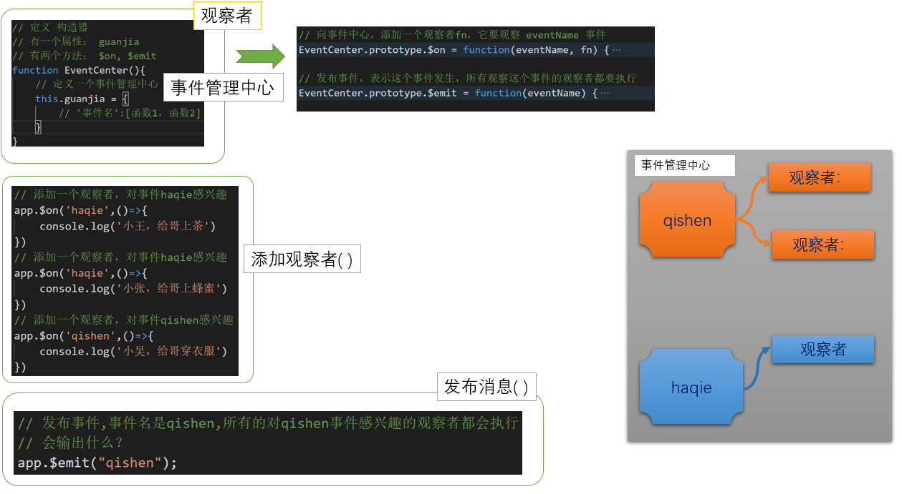

vue中双向数据绑定：

- Object.defineproperty
- 观察者模式


## 问题导入

vue中的事件订阅与发布

```javascript
// 事件总线 EventBus
const app = new Vue();

// 添加一个观察者，对事件a感兴趣
app.$on('a',()=>{
	console.log('a1')
})
// 添加一个观察者，对事件a感兴趣
app.$on('a',()=>{
	console.log('a2')
})
// 添加一个观察者，对事件a感兴趣
app.$on('b',()=>{
	console.log('b')
})

// 发布事件,事件名是a,所有的对a事件感兴趣的观察者都会执行
app.$emit("a"); 
```


当运行 app.$emit('a'), app.$emit('b')时会执行相应的函数。

上面的代码是如何实现的？ 下面我们来写代码自已实现一下。


##  观察者模式

观察者模式定义了一种**一对多的依赖关系**，让多个观察者对象同时监听某一个目标对象，当这个目标对象的状态发生变化时，会通知所有观察者对象，使它们能够自动更新。

> 生活中：娟娟同学(目标对象)有两个fans(观察者)，娟娟同学打呵欠，两个fans上前表示关心（自动更新）
>
> 在vue中的体现当一个数据项的值改变之后，多个视图都跟着变。


观察者：它是一个函数。

事件：一个标识符。

当这个事件发生时，观察者会产生对应的动作：调用自已。一个事件有多个观察者，当这个事件发生时，多个观察都会执行。


## 技能点1：如何依次执行多个函数

思路：

​	把多个函数收集在数组，然后对数组进行循环遍历，依次执行每一个函数。

​    **数组中放入函数**

代码：

```javascript
function fan1(){
    console.log('我要给娟娟送coffee')
}

function fan2(){
    console.log('我要给娟娟送蜂蜜')
}

function fan3(){
    console.log('我要给娟娟送毛毯')
}

// 数组
// 数组中的元素 竟然是 函数 
var arr = [fan1,fan2]

// 添加一个元素到数组中，也是一个函数
arr.push(fan3)

arr.push(()=>{
    console.log('送给娟娟一枝铅笔')
})

// 对数组进行循环，取出数组元素，并依次执行
arr.forEach(fn => {
    // fn 就是数组元素，就是函数
    fn()
})
```


## 技能点2：当某个特定的事件，执行多个函数

思路：

- 构造一个对象，属性名是就是事件名，属性值就是数组，其中保存多个函数

```javascript
// 雷哥：
//    起身  ： 小王，小张
//    摆手  ： 小于
//    哈欠  ： 小龙 

// 定义观察者
function xiaowang(){
    console.log('雷哥起身，小王给雷哥 披外套')
}
function xiaozhang(){
    console.log('雷哥起身，小张给雷哥 拉凳子')
}
function xiaoyu(){
    console.log('雷哥摆手，小于给雷哥 上烟')
}
function xiaolong(){
    console.log('雷哥哈欠，小龙给雷哥 上coffee')
}

// 管家，分配任务
// 定义一个对象，属性名就是事件，属性值就是数组，数组中每一个元素还是一个函数
let guangjia = {
    'qishen':[xiaowang, xiaozhang],
    'bashou':[xiaoyu],
    'haqie':[xiaolong],
}

// 来个新fans,小吴 在 哈欠 ，递蜂蜜
guangjia.haqie.push(function xiaowu(){
    console.log('我是新人，我要上蜂蜜')
})

// 雷哥 起身
// guangjia.qishen.forEach(fn => {
//     fn()
// })
// 雷哥 哈欠
guangjia.haqie.forEach(fn => {
    fn()
})
```


## 改成面向对象的写法

把上面的代码，优化一下，改成面向对象的写法。

```javascript
<script>
    // 定义 构造器
    // 有一个属性： guanjia
    // 有两个方法： $on, $emit
function EventCenter(){
    // 定义一个事件管理中心
    this.guanjia = {
        // '事件名':[函数1，函数2]
    }
}
// 向事件中心，添加一个观察者fn，它要观察 eventName 事件 
EventCenter.prototype.$on = function(eventName, fn) {
    // eventName变量，要访问对应的属性，就要用[]
    if(this.guanjia[eventName]){
        // 如果这个事件已经在事件中心 注册过了,就直接push
        this.guanjia[eventName].push(fn)
    } else{
        // 如果事件之前没有在事件中心 注册过了,就创建一个数组，把它放进去
        this.guanjia[eventName] = [ fn ]
    }
}

// 发布事件，表示这个事件发生，所有观察这个事件的观察者都要执行
EventCenter.prototype.$emit = function(eventName) {
    // this.guanjia[eventName] // 得到一个数组
    // console.log(eventName )
    // console.log(this.guanjia)
    // console.log(this.guanjia[eventName] )
    this.guanjia[eventName].forEach(fn => {
        fn()
    })
}

// -----------上面完整实现了观察者模式----------------------

const app = new EventCenter();

// 添加一个观察者，对事件haqie感兴趣
app.$on('haqie',()=>{
    console.log('小王，给哥上茶')
})
// 添加一个观察者，对事件haqie感兴趣
app.$on('haqie',()=>{
    console.log('小张，给哥上蜂蜜')
})
// 添加一个观察者，对事件qishen感兴趣
app.$on('qishen',()=>{
    console.log('小吴，给哥穿衣服')
})

// 发布事件,事件名是qishen,所有的对qishen事件感兴趣的观察者都会执行
// 会输出什么？
app.$emit("qishen"); 
</script>
```

## 示意图



