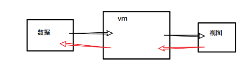
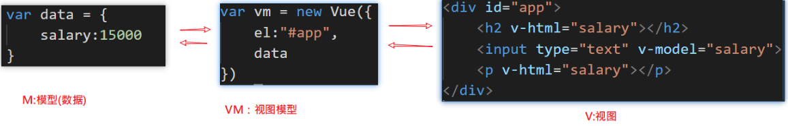
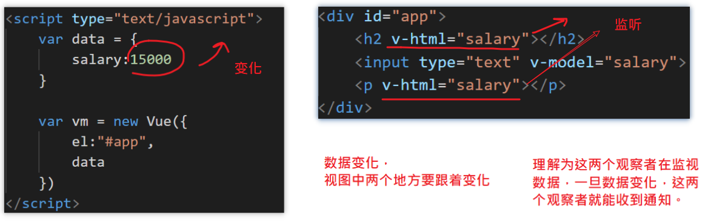
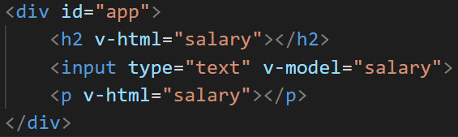
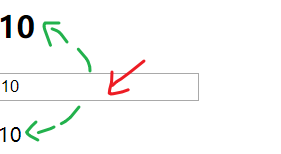
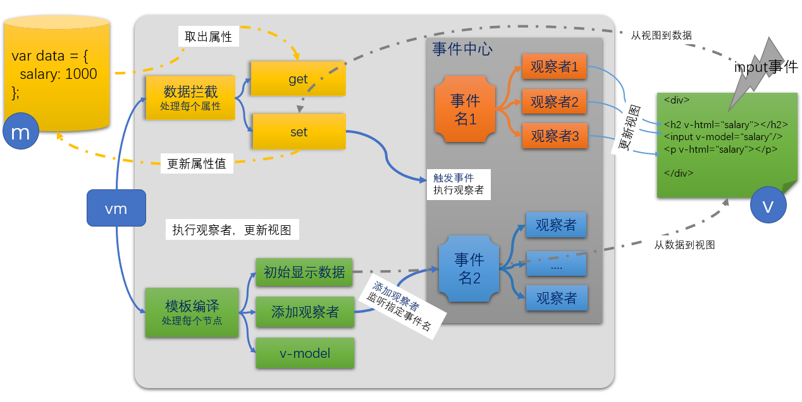

基础知识

- definedProperty
- 观察者模式

目标：

- 实现数据双向绑定功能。
- 更深理解mvvm模型，数据驱动视图。


## 回顾vuejs中的双向绑定

- 从数据到视图。当数据变化时，视图也跟着变化。
- 从视图到数据。当input框中的内容变化时，数据也跟着变化。


## mvvm与vuejs

mvvm是一种设计模式，是实现数据双向绑定的一种方式。

- m：model:数据,模型

- v：view:视图

- vm: 视图模型

vuejs体现了mvvm的设计思想。





## 目标及思路

### 目标

实现一个MVVM构造器，它让下面这段代码的功能与Vue的功能是一致的

```html
<div id="app">
    <h2 v-html="salary"></h2>
    <input type="text" v-model="salary">
    <p v-html="salary"></p>
</div>
<script type="text/javascript">
    var data = {
        salary:15000
    }

    // 实现一个MVVM
    var vm = new MVVM({
        el:"#app",
        data
    })
</script>
```

### 整体思路

从两个方向来分别介绍实现思路。

#### 从数据到视图

两个阶段：

- **最初始时，把要对象中的属性值显示在视图上。**
- 当属性值变化时，视图也要变。

现象：

​	当对象中的某个属性变化时，页面上用到了这属性的dom都要变化。举个例子。



实现技术：

- 数据拦截：**目标是要知道什么时候数据发生了变化**。侵入到到数据内部，当数据（对象的属性值）发生变化时，我们可以得知。在它们变化时，发布这个通知。
- 编译模板：
  - 分析出哪些dom是依赖于哪些数据的变化的。
  - 当前数据变化时，它们要跟着变化：这里就要用到观察者模式。

#### 从视图到数据

用户在视图上修改了数据，这个修改要反应数据上。由于只有表单元素才提供输入功能，所以只需要在表单元素中添加对应的dom事件，再去回调函数中修改数据。

## 实现基本构造器

目标：

- 写出构造器的基本架子，完成参数传递与获取。这里的参数只有两个:el,data
- 实现数据拦截：
  - 在代码外部，让MVVM实例可以操作data选项中的属性。
  - 在代码内部，能通过`this.属性名` 的方式去操作data选项中的属性。

```javascript
function MVVM(options) {
    // let _data = options.data
    const {data,el} = options
    // console.log(options.data)
    // 通过Objecject.defineProperty来拦截对data属性的操作
    // 在构造器内部，this是一个对象，就指向的是当前实例
    // console.log(this === vm);
    // this.abc = "123"
    // 对data项中的属性进行拦截
    for(let key in data) {
        Object.defineProperty(this,key,{
            // val 是新值
            set(val){
                if(val == data[key]) {
                    return
                }
                // console.log(`${key} 设置${val}`)
                data[key] = val;
            },
            get() {
                // console.log(`获取${key}`)
                return data[key]
            }
        })
    }
}

var data = {
    salary: 10000,
};
var vm = new MVVM({
    el: "#app",
    data
});
// 测试数据拦截效果
vm.salary = 10000; // 
console.log(data)
```


接下来就要实现从数据到视图的变化了。


## 模板编译并初始显示内容

对这里的内容进行分析：



整体目标：遍历根结点，依次找出其下所有的dom子节点，分析是否有v-html,v-model属性，如果有的话，则要特殊处理。

### 处理 v-html

由于有v-html的节点来说，我们需要：

- 显示初始值
- 当数据变化时，更新内容。

在这一步只做显示初始值。

```javascript
function MVVM(options) {
    // let _data = options.data
    const {data,el} = options
    // console.log(options.data)
    // 通过Objecject.defineProperty来拦截对data属性的操作
    // 在构造器内部，this是一个对象，就指向的是当前实例
    // console.log(this === vm);
    // this.abc = "123"
    // 对data项中的属性进行拦截
    for(let key in data) {
        Object.defineProperty(this,key,{
            // val 是新值
            set(val){
                if(val == data[key]) {
                    return
                }
                // console.log(`${key} 设置${val}`)
                data[key] = val;
                // 修改了属性值，则要通过所有对应的观察者

                // 发布事件，则所有的观察者都应该去执行
                ec.emit(key);
            },
            get() {
                // console.log(`获取${key}`)
                return data[key]
            }
        })
    }

    // 解析模板
    var rootDom = document.querySelector(el);
    Array.from(rootDom.children).forEach(dom=>{
        if(dom.hasAttribute("v-html")) {
            // 取出属性值：
            // 把对象中的key属性的值，显示在当前的元素中。
            var key = dom.getAttribute("v-html");
            dom.innerHTML = this[key]
        }
    })
}
```

### 处理 v-model

由于有v-model的节点来说，我们需要：

- 显示初始值
- 当数据变化时，更新内容
- 当用户在其中输入内容时，数据也要随之变化

在这一步只做显示初始值。

```javascript
// 解析模板
    var rootDom = document.querySelector(el);
    Array.from(rootDom.children).forEach(dom=>{

        if(dom.hasAttribute("v-html")) {
            // 取出属性值：
            // 把对象中的key属性的值，显示在当前的input框中。
            var key = dom.getAttribute("v-html");
            dom.innerHTML = this[key]
        } 
		else if( dom.hasAttribute("v-model") ) {
			// 取出属性值：
			// 把对象中的key属性的值，显示在当前的input框中。
			var key = dom.getAttribute("v-model");
			dom.value = this[key]
		}
    })

```


## 数据变化反映到视图

下面要实现的目标是当数据变化时，及时去更新视图。一个数据的变化可能会引起多处视图的变化。

```javascript
vm.salary = 20000
```


### 分析

以下面的视图为例:

- 当salary变化时，下面的三处dom都要改变

```html
<div id="app">
    <h2 v-html="salary"></h2>
    <input type="text" v-model="salary">
    <p v-html="salary"></p>
</div>
```


可以使用观察者模式：

- 把属性名当成事件名
- 每一个结点都是观察者

当属性值变化时，发布指定的事件，来通知观察者们。

| 序号 | 事件名 | 观察者                                 | 动作     |
| ---- | ------ | -------------------------------------- | -------- |
| 1    | salary | `<h2 v-html="salary"></h2>`            | 更新自已 |
| 2    | salary | `<input type="text" v-model="salary">` | 更新自已 |
| 3    | salary | `<p v-html="salary"></p>`              | 更新自已 |

### 思路

- 引入观察者代码
- 在数据变化时去发布事件
  - 在数据拦截时，给set方法中 添加代码，来发布事件
- 在模板编译时去监听事件
  - 在模板编译时，添加观察者。

### 步骤

一共有四步。

#### 引入观察者代码

引入观察者代码

```javascript
<script type="text/javascript">
function EventEmitter () {
    this.subs = {}
}
EventEmitter.prototype.addListener = function(eventType, callback) {
    this.subs[eventType] = this.subs[eventType] || []
    this.subs[eventType].push(callback)
}
EventEmitter.prototype.fire = function(eventType) {
    this.subs[eventType] && this.subs[eventType].forEach(callback => {
        callback()
    })
}
</script>
```

上面的代码已经在前面单独学习过，这里就不再展开，这里拿过来用即可。

#### 实例化一个事件管理器

```javascript
var em = new EventEmitter()
```

这个事件管理器与MVVM的构造器无关，它是独立存在的。

#### 在数据变化时去发布事件

在set()拦截器中添加一句代码`em.fire()`

```diff
function MVVM(options) {
    //1. 数据拦截
    const {data,el} = options

    for(let key in data) {
        Object.defineProperty(this,key,{
            get() {
                return data[key]
            },
            set(value) {
                if(value != data[key]){
                    console.log(`${key}被修改了`)
                    data[key] = value
+                   em.fire(key)
                }
            }
        })
    }
    // ...
}
```

#### 在模板编译时添加监听者

添加监听者之后，当对应的事件发生时（属性值变化时），监听者会自动执行（更新视图）。这个部分的工作机制是由观察者模式提供的。

```diff
// 解析模板
var rootDom = document.querySelector(el);
Array.from(rootDom.children).forEach(dom=>{

    if(dom.hasAttribute("v-html")) {
        // 取出属性值：
        // 把对象中的key属性的值，显示在当前的input框中。
        var key = dom.getAttribute("v-html");
        dom.innerHTML = this[key]

        // 添加监听者
        // 当key属性发生变化时，去更新input框中的值
+      ec.addListener(key,()=>{
+            dom.innerHTML = this[key]
+        })
    } 
    else if( dom.hasAttribute("v-model") ) {
        // 取出属性值：
        // 把对象中的key属性的值，显示在当前的input框中。
        var key = dom.getAttribute("v-model");
        dom.value = this[key]

        // 添加监听者
        // 当key属性发生变化时，去更新input框中的值
+        ec.addListener(key,()=>{
+            dom.value = this[key]
+        })
    }
})
```


### 测试

```javascript
<script>
    var data = {
        salary: 10000,
    };
var vm = new MVVM({
    el: "#app",
    data
});

</script>
```

在控制台中直接修改vm.salary值来观察视图上的变化。


## 从视图到数据

### 目标

用户在视图上的修改也应该反映在数据上。也就是说，当input框中的内容变化时，vm.salary的值也要变化，同时两处对应的v-html的内容也要变化，



### 思路

给input添加change事件，当值变化时，去修改对应的属性值。

只需要在处理v-model时，给input框添加input事件

```diff
else if( dom.hasAttribute("v-model") ) {
    // 取出属性值：
    // 把对象中的key属性的值，显示在当前的input框中。
    var key = dom.getAttribute("v-model");
    dom.value = this[key]

    // 添加监听者
    // 当key属性发生变化时，去更新input框中的值
    ec.addListener(key,()=>{
        dom.value = this[key]
    })

    // 给元素本身添加input事件
+    dom.addEventListener("input",(e)=>{
        // console.dir(e)
        // 1. 获取当前用户改完之后的值
        //    console.log(e.target.value)
        // 2. 设置给对象的属性值（数据）
        //    会进入到set拦截器
+        this[key] = e.target.value
+    })
}
```

## 小结

