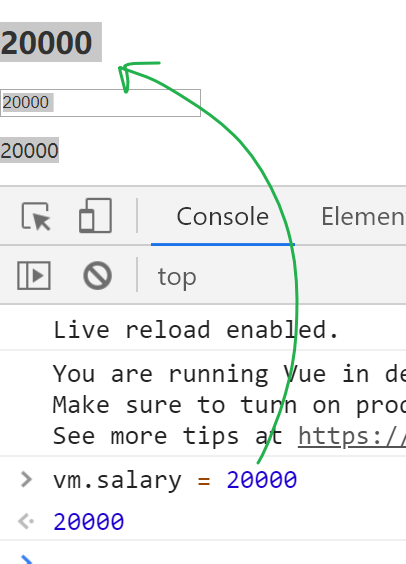
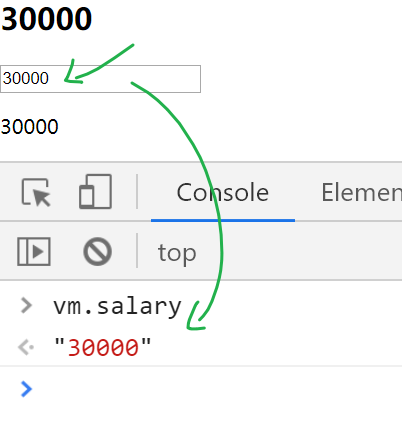

基础知识

- definedProperty
- 观察者模式

目标：

- 实现数据双向绑定功能。
- 更深理解mvvm模型，数据驱动视图。


## 回顾vuejs中的双向绑定

- 从数据到视图。当数据变化时，视图也跟着变化。
- 
- 从视图到数据。当input框中的内容变化时，数据也跟着变化。



## mvvm与vuejs

mvvm是一种设计模式，是实现数据双向绑定的一种方式。

- m：model:数据,也称为模型

- v：view:视图

- vm: 视图模型

vuejs体现了mvvm的设计思想。


## 目标及思路

### 目标

实现一个MVVM构造器，它让下面这段代码的功能与Vue的功能是一致的

```html
<div id="app">
    <h2 v-html="salary"></h2>
    <input type="text" v-model="salary">
    <p v-html="salary"></p>
</div>
<script type="text/javascript">
    var data = {
        salary:15000
    }

    // 实现一个MVVM
    var vm = new MVVM({
        el:"#app",
        data
    })
</script>
```

### 整体思路

从两个方向来分别介绍实现思路。

#### 从数据到视图

两个阶段：

- **最初始时，把要对象中的属性值显示在视图上。**
- 当属性值变化时，视图也要变。

现象：

​	当对象中的某个属性变化时，页面上用到了这属性的dom都要变化。举个例子。


实现技术：

- 数据拦截（Object.defineProperty）：**目标是要知道什么时候数据发生了变化**。侵入到到数据内部，当数据（对象的属性值）发生变化时，我们可以得知。在它们变化时，发布这个通知。
- 编译模板：
  - 分析出哪些dom是依赖于哪些数据的变化的。
  - 当前数据变化时，它们要跟着变化：这里就要用到**观察者模式**。

#### 从视图到数据

用户在视图上修改了数据，这个修改要反应数据上。由于只有表单元素才提供输入功能，所以只需要在表单元素中添加对应的dom事件，再去回调函数中修改数据。

## 实现基本构造器

目标：

- 写出构造器的基本架子，完成参数传递与获取。这里的参数只有两个:el,data
- 实现数据拦截：
  - 在代码外部，让MVVM实例可以操作data选项中的属性。
  - 在代码内部，能通过`this.属性名` 的方式去操作data选项中的属性。

```javascript
// 手写代码实现MVVM的功能，目标与Vue实现的效果在本例中一致
function MVVM(options){
    // 用解构赋值，快速取出数据
    let {el, data} = options
    console.log(el, data)
    // 在构造器的内部，this的值是实例对象
    for( let  key in data) {
        // 循环取 data对象中的属性名
        Object.defineProperty(this,key,{
            get(){
                return data[key]
            },
            set(val){
                data[key] = val
            }
        })
    }
    console.log( "this.salary", this.salary)
}

var data = {
    salary: 10000,
};
var vm = new MVVM({
    el: "#app",
    data
});
// 测试数据拦截效果
vm.salary = 10000; // 
console.log(data)
```


接下来就要实现从数据到视图的变化了。


## 模板编译并初始显示内容

对这里的内容进行分析：


整体目标：遍历根结点，依次找出其下所有的dom子节点，分析是否有v-html,v-model属性，如果有的话，则要特殊处理。

如何判断元素是否有`v-html`属性？

### 处理 v-html

由于有v-html的节点来说，我们需要：

- 显示初始值
- 当数据变化时，更新内容。

在这一步只做显示初始值。

```javascript
function MVVM(options) {
    // let _data = options.data
    const {data,el} = options
    // console.log(options.data)
    // 通过Objecject.defineProperty来拦截对data属性的操作
    // 在构造器内部，this是一个对象，就指向的是当前实例
    // console.log(this === vm);
    // this.abc = "123"
    // 对data项中的属性进行拦截
    for(let key in data) {
        Object.defineProperty(this,key,{
            // val 是新值
            set(val){
                if(val == data[key]) {
                    return
                }
                // console.log(`${key} 设置${val}`)
                data[key] = val;
                // 修改了属性值，则要通过所有对应的观察者

                // 发布事件，则所有的观察者都应该去执行
                ec.emit(key);
            },
            get() {
                // console.log(`获取${key}`)
                return data[key]
            }
        })
    }

    // console.log( "this.salary", this.salary)
    // 模板编译（分析）,把v-html,v-model的值显示出来
    // 取出el表示的根结点下的所有子元素
    var rootDom = document.querySelector(el);
    // 通过children获取所有子元素集合：它是一个伪数组。
    // Array.from()把它转成数组
    Array.from(rootDom.children).forEach((node)=>{
        // 分析每个子节点是否包含v-html,v-model属性
        // dom结点.hasAttribute('属性名'). 如果有，则返回true；否则就是false
        if( node.hasAttribute('v-html') ){
            // 则应该把 v-html的属性值 'salary' 取出来，显示在这个结点中。
            // 如何获取一个名为v-html的属性值？
            var attVal = node.getAttribute('v-html')
            // attVal是一个变量名，不能通过this.attVal来访问，只能通过[]来访问
            console.log(attVal, this[attVal])

            // 把一个名为attVal的属性值，显示在这dom节点上
            node.innerHTML = this[attVal]
        }
    })
}
```

### 处理 v-model

由于有v-model的节点来说，我们需要：

- 显示初始值
- 当数据变化时，更新内容
- 当用户在其中输入内容时，数据也要随之变化

在这一步只做显示初始值。

```javascript
// 手写代码实现MVVM的功能，目标与Vue实现的效果在本例中一致
function MVVM(options){
    // 用解构赋值，快速取出数据
    let {el, data} = options
    console.log(el, data)
    // 在构造器的内部，this的值是实例对象
    for( let  key in data) {
        // 数据拦截
        // 所有通过vm.XXX访问的属性，本质上就是在访问 options.data.XXX
        Object.defineProperty(this,key,{
            get(){
                return data[key]
            },
            set(val){
                data[key] = val
            }
        })
    }
    // console.log( "this.salary", this.salary)
    // 模板编译（分析）,把v-html,v-model的值显示出来
    // 取出el表示的根结点下的所有子元素
    var rootDom = document.querySelector(el);
    // 通过children获取所有子元素集合：它是一个伪数组。
    // Array.from()把它转成数组
Array.from(rootDom.children).forEach((node)=>{
    // 分析每个子节点是否包含v-html,v-model属性
    // dom结点.hasAttribute('属性名'). 如果有，则返回true；否则就是false
    if( node.hasAttribute('v-html') ){
        // 则应该把 v-html的属性值 'salary' 取出来，显示在这个结点中。
        // 如何获取一个名为v-html的属性值？
        var attVal = node.getAttribute('v-html')
        // attVal是一个变量名，不能通过this.attVal来访问，只能通过[]来访问
        console.log(attVal, this[attVal])

        // 把一个名为attVal的属性值，显示在这dom节点上
        node.innerHTML = this[attVal]
    }
    else if(node.hasAttribute('v-model') ){
        // 则应该把 v-model的属性值 'salary' 取出来，显示在这个结点中。
        // 如何获取一个名为v-model的属性值？
        var attVal = node.getAttribute('v-model')
        // attVal是一个变量名，不能通过this.attVal来访问，只能通过[]来访问
        console.log(attVal, this[attVal])

        // 把一个名为attVal的属性值，显示在这dom节点上
        // 当前dom是input框，设置初始值要用value属性
        node.value = this[attVal]
    }

})

```


## 数据变化反映到视图

下面要实现的目标是当数据变化时，及时去更新视图。一个数据的变化可能会引起多处视图的变化。

```javascript
vm.salary = 20000
```

### 分析

以下面的视图为例:

- 当salary变化时，下面的三处dom都要改变

```html
<div id="app">
    <h2 v-html="salary"></h2>
    <input type="text" v-model="salary">
    <p v-html="salary"></p>
</div>
```


可以使用观察者模式：

- 把属性名当成事件名
- 对一个结点都创建一个观察者（函数）

当属性值变化时，发布指定的事件，来通知观察者们。

| 序号 | 事件名 | 观察者                                 | 动作     |
| ---- | ------ | -------------------------------------- | -------- |
| 1    | salary | `<h2 v-html="salary"></h2>`            | 更新自已 |
| 2    | salary | `<input type="text" v-model="salary">` | 更新自已 |
| 3    | salary | `<p v-html="salary"></p>`              | 更新自已 |

### 思路

- 引入观察者代码
- 在数据变化时去发布事件
  - 在数据拦截时，给set方法中 添加代码，来发布事件
- 在模板编译时去监听事件
  - 在模板编译时，添加观察者。

### 步骤

一共有四步。

#### 引入观察者代码

引入观察者代码

```javascript
<script>
    // 定义 构造器
    // 有一个属性： guanjia
    // 有两个方法： $on, $emit
function EventCenter(){
    // 定义一个事件管理中心
    this.guanjia = {
        // '事件名':[函数1，函数2]
    }
}
// 向事件中心，添加一个观察者fn，它要观察 eventName 事件 
EventCenter.prototype.$on = function(eventName, fn) {
    // eventName变量，要访问对应的属性，就要用[]
    if(this.guanjia[eventName]){
        // 如果这个事件已经在事件中心 注册过了,就直接push
        this.guanjia[eventName].push(fn)
    } else{
        // 如果事件之前没有在事件中心 注册过了,就创建一个数组，把它放进去
        this.guanjia[eventName] = [ fn ]
    }
}

// 发布事件，表示这个事件发生，所有观察这个事件的观察者都要执行
EventCenter.prototype.$emit = function(eventName) {
    // this.guanjia[eventName] // 得到一个数组
    // console.log(eventName )
    // console.log(this.guanjia)
    // console.log(this.guanjia[eventName] )
    this.guanjia[eventName].forEach(fn => {
        fn()
    })
}
</script>
```

上面的代码已经在前面单独学习过，这里就不再展开，这里拿过来用即可。

#### 实例化一个事件管理器

```javascript
// 创建一个观察者实例
var em = new EventCenter()
```

这个事件管理器与MVVM的构造器无关，它是独立存在的。

#### 在数据变化时去发布事件

在set()拦截器中添加一句代码`em.$emit()`

```diff
// 手写代码实现MVVM的功能，目标与Vue实现的效果在本例中一致
        function MVVM(options){
            // 用解构赋值，快速取出数据
            let {el, data} = options
            console.log(el, data)
            // 在构造器的内部，this的值是实例对象
            for( let  key in data) {
                // 数据拦截
                // 所有通过vm.XXX访问的属性，本质上就是在访问 options.data.XXX
                Object.defineProperty(this,key,{
                    get(){
                        return data[key]
                    },
                    set(val){
                        data[key] = val

                        // 发布事件，它会去执行所有的这个事件的观察者的代码
+                        em.$emit(key)
                    }
                })
            }
```

#### 在模板编译时添加监听者

添加监听者之后，当对应的事件发生时（属性值变化时），监听者会自动执行（更新视图）。这个部分的工作机制是由观察者模式提供的。

```javascript
Array.from(rootDom.children).forEach((node)=>{
    // 分析每个子节点是否包含v-html,v-model属性
    // dom结点.hasAttribute('属性名'). 如果有，则返回true；否则就是false
    if( node.hasAttribute('v-html') ){
        // 则应该把 v-html的属性值 'salary' 取出来，显示在这个结点中。
        // 如何获取一个名为v-html的属性值？
        var attVal = node.getAttribute('v-html')
        // attVal是一个变量名，不能通过this.attVal来访问，只能通过[]来访问
        console.log(attVal, this[attVal])

        // 把一个名为attVal的属性值，显示在这dom节点上
        node.innerHTML = this[attVal]


        // 在这个结点添加观察者
        // em.$on('事件名','执行的函数')
+                   em.$on(attVal,()=>{
+                       // 更新当前结点innerHTML
+                       node.innerHTML = this[attVal]
+                   })
        }
   else if(node.hasAttribute('v-model') ){
            // 则应该把 v-model的属性值 'salary' 取出来，显示在这个结点中。
            // 如何获取一个名为v-model的属性值？
            var attVal = node.getAttribute('v-model')
            // attVal是一个变量名，不能通过this.attVal来访问，只能通过[]来访问
            console.log(attVal, this[attVal])

            // 把一个名为attVal的属性值，显示在这dom节点上
            // 当前dom是input框，设置初始值要用value属性
            node.value = this[attVal]

            // 添加观察者
+                   em.$on(attVal,()=>{
+                       node.value = this[attVal]
+                   })
            }
})
```


### 测试

```javascript
<script>
    var data = {
        salary: 10000,
    };
var vm = new MVVM({
    el: "#app",
    data
});

</script>
```

在控制台中直接修改vm.salary值来观察视图上的变化。


## 从视图到数据

### 目标

用户在视图上的修改也应该反映在数据上。也就是说，当input框中的内容变化时，vm.salary的值也要变化，同时两处对应的v-html的内容也要变化，


### 思路

给input添加`input`事件，当input框中值变化时，去修改对应的属性值。

只需要在处理v-model时，给input框添加input事件

```diff
else if(node.hasAttribute('v-model') ){
    // 则应该把 v-model的属性值 'salary' 取出来，显示在这个结点中。
    // 如何获取一个名为v-model的属性值？
    var attVal = node.getAttribute('v-model')
    // attVal是一个变量名，不能通过this.attVal来访问，只能通过[]来访问
    console.log(attVal, this[attVal])

    // 把一个名为attVal的属性值，显示在这dom节点上
    // 当前dom是input框，设置初始值要用value属性
    node.value = this[attVal]

    // 添加观察者
    em.$on(attVal,()=>{
        node.value = this[attVal]
    })

    // 给input框添加input事件，
+    node.addEventListener('input',(e)=>{
+        // 获取到了当前用户的输入值
+        console.log(e.target.value )
        // 更新到对应的数据中去
        // 给属性设置了新值，会触发set, 又会更新视图
+        this[attVal] = e.target.value
+    })
}
```

## 小结

