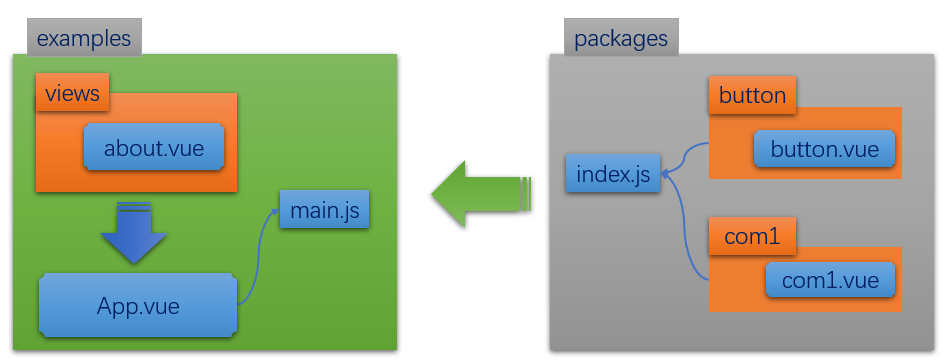

目标：

通过vuecli创建项目，这个项目创建的目的有三个：

- 维护组件库（不是某个具体的业务项目哦，而是造轮子）
- 本地测试组件库
- 整体打包上传到npm


## 使用脚手架工具创建项目

命令：

```bash
vue create XXXXX
```

要点：

- 在Babel + Router + Linter/Formatter

  

```
Vue CLI v3.11.0
┌───────────────────────────┐
│  Update available: 4.2.3  │
└───────────────────────────┘
? Please pick a preset: (Use arrow keys)
> normal (vue-router, vuex, less, babel, eslint)
  default (babel, eslint)
  Manually select features  
```


```
? Please pick a preset: Manually select features
? Check the features needed for your project:
 (*) Babel
 ( ) TypeScript
 ( ) Progressive Web App (PWA) Support
>(*) Router
 ( ) Vuex
 ( ) CSS Pre-processors
 (*) Linter / Formatter
 ( ) Unit Testing
 ( ) E2E Testing 
 
 ? Use history mode for router? (Requires proper server setup for index fallback in production) Yes
? Pick a linter / formatter config:
  ESLint with error prevention only
  ESLint + Airbnb config
> ESLint + Standard config
  ESLint + Prettier 
  
  ? Pick additional lint features: (Press <space> to select, <a> to toggle all, <i> to invert selection)
>(*) Lint on save


? Where do you prefer placing config for Babel, PostCSS, ESLint, etc.?
> In dedicated config files
```


## 调整目录结构

### 调整明细

```
|-docs (额外添加的)       组件使用手册。用来保存对组件的说明 
|-packages(额外添加的)    所有的组件放在这里。
|-examples(把src改成这个） 主要是方便我们理解。examples下的内容是来测试
packages下的组件的使用
```

### 设置vue.config.js 

由于这里改了src这个目录的名字，所以还需要做一些设置。创建vue.config.js

```
const path = require('path')
module.exports = {
  // 将 examples 目录添加为新的页面
  pages: {
    index: {
      // page 的入口
      entry: 'examples/main.js',
      // 模板来源
      template: 'public/index.html',
      // 输出文件名
      filename: 'index.html'
    }
  },
  configureWebpack: {
    resolve: {
      alias: {
        '@': path.resolve('./examples')
      }
    }
  }
}

```

## 创建一个组件

在packages目录下建立button/button.vue。先随意添加一些内容，等我们后面再来调整。

目前，这它的内容如下。

```
<template>
  <div>
    <button>我是一个按钮</button>
  </div>
</template>

<script>
export default {
  name: 'MyButton',
  data () {
    return {}
  }
}
</script>
```

## 导出这个组件

在packages目录下，创建index.js文件。用它来收集所有定义在packages目录下的组件，并按vue插件的格式做导出。

```javascript
import Button from './button/button.vue'

export default {
  install (Vue) {
    Vue.component('MyButton', Button)
  }
}
```

## 在注册为全局组件

在examples下的main.js目录下

```javascript
import Vue from 'vue'
import App from './App.vue'
import router from './router'

import UI from '../packages/index'
Vue.use(UI)

Vue.config.productionTip = false

new Vue({
  router,
  render: h => h(App)
}).$mount('#app')

```

## 在其它组件中使用

在examples/views/about.vue，直接使用这个组件

```javascript
<template>
  <div class="about">
    <h1>This is an about page</h1>
    <my-button></my-button>
  </div>
</template>

```


## 小结和回顾

### 目录结构


### 工作流程




## 类似去完成另一个组件Headline


好的。下面，我们去详细完成组件的功能。