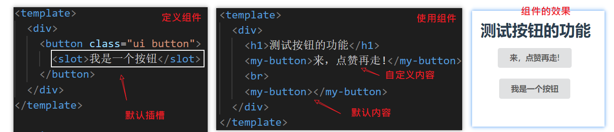
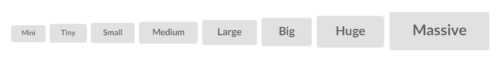
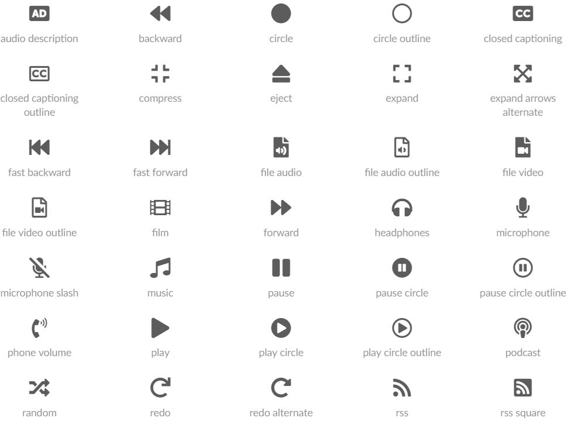

目标：

- 引入semantic.css来提供组件库的样式

- 完成按钮组件的功能


## 引入并安装 semantic

### npm i

在我们的项目中，我们只需要样式，而不需要.js代码，所以我们直接去安装semantic-ui-css。

https://www.npmjs.com/package/semantic-ui-css


### 在packages中引入css样式

```
import 'semantic-ui-css/semantic.css'
import MyButton from './button/button.vue'
export default {
  install (Vue) {
    Vue.component('MyButton', MyButton)
  }
}
```

### 修改button组件

补充css类"ui button"，这个类已经在semantic.css中定义了的。具体参考[这里](https://semantic-ui.com/elements/button.html#) https://semantic-ui.com/elements/button.html#

```javascript
<template>
  <div>
    <button class="ui button">我是一个按钮</button>
  </div>
</template>

<script>
export default {
  name: 'MyButton',
  data () {
    return {}
  }
}
</script>

```

### 测试效果

在examples目录下的组件中再次去感受一下按钮的效果。


## 修改button组件的功能

- 自定义内容
- 大小
- 图标
- 禁用状态
- 加载状态
- 动画按钮

## 自定义按钮内容

目标：允许用户自已设置按钮上的方案。

技能点：默认插槽。

步骤:

- 修改packages/button/button.vue中的代码。添加一个插槽即可。



```html
<div>
    <button class="ui button">
        <slot>我是一个按钮</slot>
    </button>
</div>
```


## 定义按钮大小

目标：预设尺寸，供用户选用。

思路：在semantic样式体系中，它通过mini,tiny,small，medium,large,big,huge,massive来控制，我们可以直接来借用。

例如：



对应html代码

```html
<button class="mini ui button">Mini</button>
<button class="tiny ui button">Tiny</button>
<button class="small ui button">Small</button>
<button class="medium ui button">Medium</button>
<button class="large ui button">Large</button>
<button class="big ui button">Big</button>
<button class="huge ui button">Huge</button>
<button class="massive ui button">Massive</button>
```

观察上面的效果，我们提取表示尺寸的关键字，在使用组件时通过prop传入。


### 修改button组件的代码

- 补充一个prop。用来接收size。
- 根据这个size来生成一个对应的class。

```
<template>
  <div>
    <button class="ui button" :class="cSize">
      <slot>我是一个按钮</slot>
    </button>
  </div>
</template>

<script>
export default {
  name: 'MyButton',
  props: {
    size: {
      type: String,
      required: false,
      default: 'small',
      validator (val) {
        return ['mini', 'tiny', 'small', 'medium', 'large', 'big', 'huge', 'massive'].includes(val)
      }
    }
  },
  data () {
    return {
      // size: this.size
    }
  },
  computed: {
    cSize () {
      return this.size
    }
  }
}
</script>

```

在设置prop时，有一点要注意:

- validator


### 修改测试用例

```html
<template>
  <div>
    <h1>测试按钮的功能</h1>
    <my-button>来，点赞再走!</my-button>
    <br>
    <my-button></my-button>
    <br>
    <my-button :size="size">mini大小的按钮</my-button>
    <br>
    <my-button size="huge">huge大小的按钮</my-button>
    <hr>
    <button @click="hChangeSize">改变大小</button>
  </div>
</template>
<script>
export default {
  data () {
    return {
      size: 'mini'
    }
  },
  methods: {
    hChangeSize () {
      this.size = 'huge'
    }
  }
}
</script>

```


## 定义图标

目标：允许用户使用预设的图标。

思路：借鉴semantic.css中的图标。 

https://semantic-ui.com/elements/icon.html



### 修改组件内容

- 添加prop，让用户传入icon的名字
- 添加计算属性，用来设置class

```
<template>
  <div>
    <button class="ui button" :class="cSize">
      <i v-if='icon' class="icon" :class="cIcon"></i>
      <slot>我是一个按钮</slot>
    </button>
  </div>
</template>

<script>
export default {
  name: 'MyButton',
  props: {
    size: {
      type: String,
      required: false,
      default: 'small',
      validator (val) {
        return ['mini', 'tiny', 'small', 'medium', 'large', 'big', 'huge', 'massive'].includes(val)
      }
    },
    icon: {
      type: String,
      required: false,
      default: ''
    }
  },
  computed: {
    cClass () {
      return [
        this.cSize,
        this.cIcon
      ].join(' ')
    },
    cSize () {
      return this.size
    },
    cIcon () {
      if (this.icon) {
        return this.icon
      } else {
        return ''
      }
    }
  }
}
</script>

```

### 测试用例

```html
<my-button  icon="user">icon为user的按钮</my-button>
<br>
<my-button  icon="history">icon为history的按钮</my-button>
```


## 设置禁用状态

目标：允许用户去设置按钮的状态

思路：借用semantic中的disabled类

### 修改组件

由于挂载在button上的样式比较多，所以用一个统一的计算属性来管理它们。

```
<template>
  <div>
    <button class="ui button" :class="cClass">
      <i v-if='icon' class="icon" :class="cIcon"></i>
      <slot>我是一个按钮</slot>
    </button>
  </div>
</template>

<script>
export default {
  name: 'MyButton',
  props: {
    // ... 省略其它
    disabled: {
      type: Boolean,
      required: false,
      default: false
    }
  },
  computed: {
    cClass () {
      return [
        this.cSize,
        this.cDisabled
      ].join(' ')
    },
    cDisabled () {
      return this.disabled ? 'disabled' : ''
    }
  }
}
</script>

```


### 测试用例

```
  <my-button  icon="history" :disabled="mDisabled">icon为history的按钮</my-button>
    <br>
    <my-button  icon="history" :disabled="false">icon为history的没有禁用按钮</my-button>
    <br>
    <my-button  icon="history" disabled>icon为history的禁用按钮</my-button>
```


## 设置loading状态

目标：允许用户去设置按钮的加载状态

思路：借用semantic中的loading类

### 修改组件

补充一个用于控制加载状态的prop及对应的class。


```
<template>
  <div>
    <button class="ui button" :class="cClass">
      <i v-if='icon' class="icon" :class="cIcon"></i>
      <slot>我是一个按钮</slot>
    </button>
  </div>
</template>

<script>
export default {
  name: 'MyButton',
  props: {
    // ... 省略其它
    loading: {
      type: Boolean,
      required: false,
      default: false
    }
  },
  computed: {
    cClass () {
      return [
        this.cSize,
        this.cDisabled,
        this.cLoading
      ].join(' ')
    },
    cLoading () {
      return this.loading ? 'loading' : ''
    }
  }
}
</script>

```


### 测试用例

```
<br>
    <my-button  icon="history" :loading="false">icon为history的loading按钮</my-button>
```


## 设置animated动画

目标：允许用户去设置按钮的切换动画状态

思路：借用semantic中的animated类

### 确定测试用例

对照semantic中按钮的动画效果来提炼用户的使用方式，即先要给出测试用例。

```html
<my-button animated >
<div slot="hidden">$10000</div>
<div slot="visible"><i class="shop icon"></i>不要错过哈</div>
</my-button>

<my-button animated="fade" >
<div slot="hidden">$10000</div>
<div slot="visible"><i class="shop icon"></i>不要错过哈</div>
</my-button>
```


### 修改组件代码

```
props: {
  animated: {
      type: [String, Boolean],
      required: false,
      default: ''
    }
  }

  computed: {
    cClass () {
      return [
        this.cSize,
        this.cIcon,
        this.cDisabled,
        this.cLoading,
        this.cAnimated
      ].join(' ')
    },
    cAnimated () {
      if (typeof this.animated === 'boolean') {
        return this.animated ? 'animated' : ''
      } else {
        return this.animated ? this.animated + ' animated' : ''
      }
    }
}
```


模板

```html
<div class="ui button" :class="cClass">
    <template v-if="cAnimated">
        <div v-if="$slots.hidden"  class="hidden content">
            <slot name="hidden"/>
        </div>
        <div v-if="$slots.visible"  class="visible content">
            <slot name="visible"/>
        </div>
    </template>
    <template v-else>
        <i v-if='icon' class="icon" :class="cIcon"></i>
        <slot>我是一个按钮</slot>
    </template>
</div>
```

注意:

- template的用法。它不需要创建新的dom容器，还可以用来包裹其它元素。
- 用`$slots.插槽名`来获取指定插槽的内容。


## 提供click功能

如果希望在使用myButton组件时添加click功能，如下，在测试用例上添加代码

```html
 <my-button @click="hClick"></my-button>
```

```javascript
methods: {
    hClick () {
      window.alert(1)
    }
  }
```

将不会得到任何效果，因为在@click只能加在原生dom元素上，而这里是一个组件。可以使用@click.native来达到目标。


更准确的做法是在组件内部抛出click事件来。


```javascript
this.$emit('click')
```