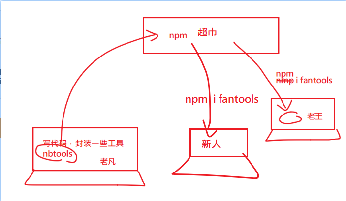
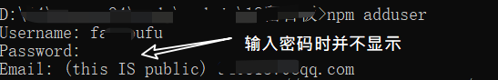

目标：打包组件库，上传到npm上。

难点:

- 自定义打包功能
- npm包发布


## [把组件代码打包](https://cli.vuejs.org/zh/guide/build-targets.html#%E6%9E%84%E5%BB%BA%E7%9B%AE%E6%A0%87)

在vue-cli脚手架工具中，当你运行 `vue-cli-service build` 时，你可以通过 `--target` 选项指定不同的构建目标。它允许你将相同的源代码根据不同的用例生成不同的构建。

### 理论介绍

#### 打包成应用 

应用模式是默认的模式。在这个模式中：

- `index.html` 会带有注入的资源和 resource hint
- 第三方库会被分到一个独立包以便更好的缓存
- 小于 4kb 的静态资源会被内联在 JavaScript 中
- `public` 中的静态资源会被复制到输出目录中

#### 打包成库

你可以通过下面的命令将一个单独的入口构建为一个库：

```bash
vue-cli-service build --target lib --dest 目标目录 --name 你的库名 入口地址
```

示例

```
vue-cli-service build --target lib --name mylib ./packages/index.js
```

- --target lib。约定以库的方式进行打包
- --name mylib。打包之后的库名字是mylib
- ./packages/index.js 。打包入口。

它会在项目根目录下的dist下创建

```
 dist\mylib.umd.min.js    14.18 KiB                5.33 KiB
 dist\mylib.umd.js        44.16 KiB                11.33 KiB
 dist\mylib.common.js     43.78 KiB                11.21 KiB
```

- common。符合commonJs 规范的包。根据CommonJS规范，一个单独的文件就是一个模块。加载模块使用require方法，该方法读取一个文件并执行，最后返回文件内部的exports对象。
- umd(Universal Module Definition)。符合直接给浏览器或者amd loader使用的包。

>  关于amd,umd,common的参考：https://www.jianshu.com/p/ec2844e0aea9。

### 具体操作

在package.json中添加一条script.

```diff
 "scripts": {
    "docs:dev": "vuepress dev docs",
    "docs:build": "vuepress build docs",
    "serve": "vue-cli-service serve",
    "build": "vue-cli-service build",
    "lint": "vue-cli-service lint",
+    "b": "vue-cli-service build --target lib --name demo_vue_ui --dest lib ./packages/index.js"
  }
```

在命令行中运行`npm run b`。如果没有什么错误，你应该可以看到lib目录下的内容了。

> 如果这个过程报错提示`no-console`之类的，你可能需要把packages下所有代码中的console都注释掉。

## 修改package.json以方便上传npm

找到package.json文件，注意修改如下三个地方：

- 取消私有 private。
- 设置版本号。一般默认是'1.0.0'，我们只能把它改小一些，因为随着后续功能的开发，我们会升级版本号。所以现在是第一个版本。
- main入口。它用来设置在其它项目中通过import "demo_vue_ui"时要进入的入口。

```javascript
  {
    "name": "demo_vue_ui",
    "version": "0.1.0",
  	"private": false,
    // dist/mylib.umd.min.js 是你上面打包的那个js文件的地址
  	"main": "dist/mylib.umd.min.js"
  }
```


## 上传到npm

- 注册npm帐号                   (只需一次，随后不需要)
- 在命令行中登陆npm帐号(只需一次，随后不需要)
- 通过`npm publish`命令发布到npm


注意：可以设置npmignore来减少文件的大小。

>  设置.npmignore文件
>
> ```bash
> # 忽略目录
> packages/
> examples/
> public/
> 
> # 忽略指定文件
> vue.config.js
> babel.config.js
> *.map
> .gitignore
> ```
>
> 

## 在其它项目中下载使用

```
npm i  ui-93
```

main.js

```
import UI from 'ui-93'
import 'ui-93/lib/ui-93.css'
Vue.use(UI)
```


附录：

# npm包从创建到发布





> 在工作中我们积累了一些自己的功能代码。这些功能代码可以在其它项目中重复使用，此时我们就可以选择把代码打包放在[npm]上,在需要要使用的项目中，通过npm install去下载下来。


## npm项目初始化

在本地磁盘上创建一个空项目，取文件夹名为`myNpm`。注意请先去npm网官去确定一下，这个项目名是否已经被占用了。（如果这个名字已经被占用了，则你是无法向npm上上传的）。

检查方式

```bash
npm view 包名
# 这个命令用来查看 某个包的信息
# 如果返回404，说明这个项目名在npm官网上找不到，此时你就可以使用。
# 否则，说明不可用。
```


> 很确定地告诉你，myNpm这个包已经被别人占用了，你需要去自己用另一个名字哈。


```
npm init --yes
```

命令来创建一个package.json文件，对你项目myNpm信息进行设置。

## 完成功能

正常开发，完成你的代码。在默认情况下，index.js是这个项目的入口文件。

下面是一个最简单的示例： 

```
// index.js是在package.json中声明的，它是整个包的入口

const add = (a,b) => a + b;

const sub = (a, b) => a - b;


// 导出两个工具
module.exports = {
    add,
    sub
}
```

## 切换当前npm镜像源到官网

由于我们需要把包上传到npm上，所以要先确保当前的npm源是npmjs.org。与之相关的命令有如下两条：

```bash
npm config get registry 
# 查看当前的npm的registry配置，确保是https://registry.npmjs.org

# 如果不是，可以通过如下命令来设置
npm config set registry https://registry.npmjs.org 
# 手动设置registry
```

或者使用nrm工具来设置。

## 连接npm

```
npm adduser  
```

这个命令需要输入三个信息以供连接上npmjs。用户名，密码，邮箱（是你在npmjs官网上注册时使用的信息）。如果你已经不是第一次连接了，这一步是可以省略的。



你也可以通过如下命令检查自己是否连接成功了。

```bash
npm who am i
```

如果这句命令可以看到你的个人信息，说明你已经连接成功了，则可以进行下一步。如果想退出当前用户名，也可以通过如下命令来退出。

```bash
npm logout
```

##  把包上传到npm

只需要如下一条命令就可以了。

```
 npm publish 
```


如果npm publish 出错了，出错的可能是：

- 这个包名被别人先用了。
- 如果你是第一次注册npm的话，先去你的邮箱里去验证邮件。(否则会给你403错误。you must verify your email before publishing a new package)
- 包的版本号不对：每次publish时，包的版本号都应该要大于之前的版本号。
- 你的npm镜像不是官网。
- 文件过大。你可能需要创建`.npmignore`文件来设置在打包时要忽略哪些文件。如下是一个demo.

```.npmignore
/node_modules
npm-debug.log
/src
/examples
/build
```

如果没有报错，则表示一切ok，你可以用你的帐号密码登陆npm，去查看你名下的package是否有了你上传的包了。

## 下载使用

在其它任意的项目中，通过`npm install myNpm`即可来安装包。 然后，告诉你的小伙伴们去下载使用吧。

## 删除包

```cpp
npm unpublish --force //强制删除
```

如果你的包没有什么用处，建议删除掉，以节约公共资源。

## 更新包

1. 修改代码，保存。
2. 更新版本号。可直接在package.json中修改：只能改大，不能改小。
3. 重新publish