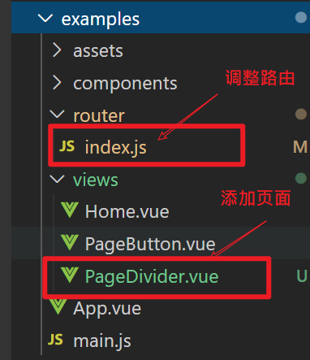
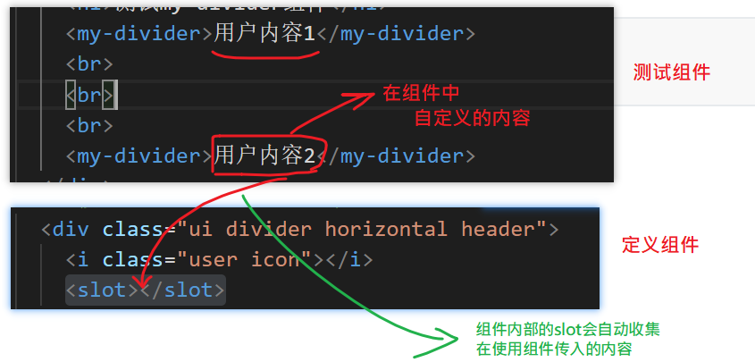

## 目标

- 向组件库中添加新的组件divider
- 效果要基本与semantic一致

## 功能

- 允许用户自定义内容
- 允许用户设置图标

## 步骤

1. 创建组件

   在packages/下添加divider/divider.vue文件

2. 导出组件

   在pageckages/index.js中引入divider.vue，并写在install方法中。

   ```diff
   // 注意，只引入css
   import 'semantic-ui-css/semantic.css'
   
   // 引入定义好的组件
   import MyButton from './button/button.vue'
   import MyHeadline from './headline/headline.vue'
   + import MyDivider from './divider/divider.vue'
   
   // 整体向外导出一个对象
   // 这个对象有一个install方法。
   export default {
     // Vue.use(对象)。它会执行对象的install方法，并传入Vue对象
     install (Vue) {
       // console.log('install ....')
       // MyButton 组件名
       Vue.component('MyButton', MyButton)
       Vue.component('MyHeadline', MyHeadline)
   +    Vue.component('MyDivider', MyDivider)
     }
   }
   ```

   

3. 在测试项目添加一个页面来测试组件

   

## 允许用户自定义内容

### 测试用例

```html
<my-divider>标题说明1</my-divider>
<my-divider>标题说明2</my-divider>
```



### 组件代码

```html
<template>
<!-- 按semantic-ui中的结构来写 -->
  <div class="ui divider horizontal header">
    <i class="user icon"></i>
    <slot></slot>
  </div>
</template>
```

主要利用  `<slot>`


## 允许用户设置图标

思路：

- 定义一个名为icon的props，收集用户传入的图标
- 在组件的内部，如果有图标，则显示，没有图标，则不显示。

```html
<my-divider icon="user">标题说明1</my-divider>
<my-divider icon="setting">标题说明2</my-divider>
<my-divider>标题说明2</my-divider>
```


## 组件代码

divider.vue

```html
<template>
<!-- 按semantic-ui中的结构来写 -->
  <div class="ui divider horizontal header">
      <!-- 如果传入了icon,就： -->
      <!-- 显示 i标签 -->
      <!-- 设置class -->
    <i v-if="icon" class="icon" :class="icon"></i>
    <slot></slot>
  </div>
</template>

<script>
export default {
  name: 'MyDivider',
  props: {
    icon: {
      type: String,
      default: '',
      required: false
    }
  }
}
</script>

```

## 暴露组件

在packages/index.js中,引入组件并注册到全局组件中。

```diff
import 'semantic-ui-css/semantic.css'
import MyButton from './button/button.vue'
+import MyDivider from './divider/divider.vue'
export default {
  install (Vue) {
    Vue.component('MyButton', MyButton)
+    Vue.component('MyDivider', MyDivider)
  }
}
```


## 测试代码

在examples中的任意组件中通过如下代码可以来测试这个功能

```html
  <h1>测试my-divider组件</h1>
    <my-divider icon="user">标题说明1</my-divider>
    <br>
    <br>
    <br>
    <my-divider icon="setting">标题说明2</my-divider>
    <br>
    <br>
    <br>
    <my-divider>标题说明2</my-divider>
    <br>
    <br>
    <br>
```

