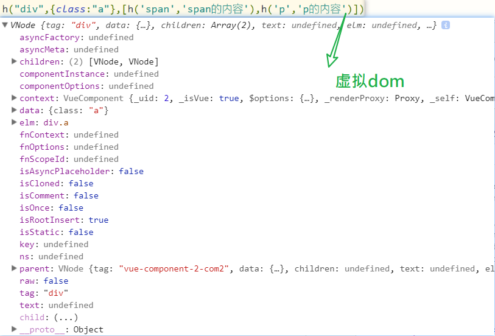

## 问题


render() created(),mounted() 的执行时间是？


如下代码你见过吗？

```javascript
import Vue from 'vue'
import App from './App.vue'
var app = new Vue({
    el: 'app',
    render: h=>h(App)
})
```

它的作用是什么？它其中的h是什么意思？


一个vue组件能够展示在页面上，因为它有tempalte，或者是render函数。它必须有这两者之一。

一般情况下，我们使用tempalte就可满足需求了。但在一些特定的情况下，我们要使用reander函数。

## 宏观概览-render


从上图中，不难发现一个Vue的应用程序是如何运行起来的，模板通过编译生成AST，再由AST生成Vue的`render`函数（渲染函数），渲染函数结合数据生成Virtual DOM树，Diff和Patch后生成新的UI。从这张图中，可以接触到Vue的一些主要概念：

- **模板**：Vue的模板基于纯HTML，基于Vue的模板语法，我们可以比较方便地声明数据和UI的关系。
- **AST**：AST是**Abstract Syntax Tree**的简称，Vue使用HTML的Parser将HTML模板解析为AST，并且对AST进行一些优化的标记处理，提取最大的静态树，方便Virtual DOM时直接跳过Diff。
- **渲染函数**：渲染函数是用来生成Virtual DOM的。Vue推荐使用模板来构建我们的应用界面，在底层实现中Vue会将模板编译成渲染函数，当然我们也可以不写模板，直接写渲染函数，以获得更好的控制 （这部分是我们今天主要要了解和学习的部分）。
- **Virtual DOM**：虚拟DOM树，Vue的Virtual DOM Patching算法是基于**[Snabbdom](https://github.com/snabbdom/snabbdom)**的实现，并在些基础上作了很多的调整和改进。
- **Watcher**：每个Vue组件都有一个对应的`watcher`，这个`watcher`将会在组件`render`的时候收集组件所依赖的数据，并在依赖有更新的时候，触发组件重新渲染。你根本不需要写`shouldComponentUpdate`，Vue会自动优化并更新要更新的UI。

上图中，`render`函数可以作为一道分割线，`render`函数的左边可以称之为**编译期**，将Vue的模板转换为**渲染函数**。`render`函数的右边是Vue的运行时，主要是基于渲染函数生成Virtual DOM树，Diff和Patch。


```
模板 -> 进行编译 -> 生成ast树 -> 数据绑定 -> 成render函数 -> 成虚拟dom -> 真实dom
```

如果直接使用render函数，就省略了模板的编译过程，vue运行的更快。


## 有两种方式来定义组件的模板

Vue推荐在绝大多数情况下使用`template`来创建你的HTML。然而在一些场景中，需要使用JavaScript的编程能力和创建HTML，这就是**`render`函数**，它比`template`更接近编译器。

- template
- render

```html
<div id="app">
    <com1></com1><br>
    <com2></com2>
</div>
<script type="text/javascript">

    Vue.component("com1",{
        data(){
            return {title:"com1"}
        },
        template:`<h2>vue-{{title}}</h2>`
    })
    Vue.component("com2",{
        data(){
            return {title:"com1"}
        },
        render(h){
            return h('h2',[`vue-`,this.title])
        }
    })
    vm = new Vue({
        el:"#app",
    })

</script>
```

## render的基本格式

```javascript
{
    data(){},
    methods:{},
    render(h){
        return h(参数1,参数2,参数3);
        // 参数1： String | Object | Function
        //        是一个html标签，或者是一个组件，或者是一个函数 

        // 参数2：Object。是对参数1所表示的对象的设置。

        // 参数3：参数1表示的对象的子对象。
    }
}
```


### render的形参和返回值

#### 形参

在render()被调用时，它会传入一个函数给h。这个函数就是createElement，在组件内部，我们也可以通过`this.$createElement`来获取它。

```bash
Vue.component("com2",{
    data(){
        return {title:"com1"}
    },
    render(h){
        console.log(this.$createElement === h); //true
        return h('h2',[`vue-`,this.title])
    },
    mounted(){
        console.log(this.$createElement)
    }
})
```

#### 返回值

render()方法使用传入的h函数来创建一个东东，然后再返回出去，那么，这个东东是什么？为什么它能起到和template一样的效果？

结论是：vnode，也就是我们说的虚拟dom.


到底会返回什么呢？其实不是一个实际的 DOM 元素。它更准确的名字可能是 `createNodeDescription`，因为它所包含的信息会告诉 Vue 页面上需要渲染什么样的节点，包括及其子节点的描述信息。我们把这样的节点描述为“虚拟节点 (virtual node)”，也常简写它为“**VNode**”。“虚拟 DOM”是我们对由 Vue 组件树建立起来的整个 VNode 树的称呼。

## createElement

### 功能

创建虚拟dom。

### 格式

```javascript
createElement h(参数1,参数2,参数3);
// 参数1： String | Object | Function
//        是一个html标签，或者是一个组件，或者是一个函数 

// 参数2：Object。是对参数1所表示的对象的设置。

// 参数3：参数1表示的对象的子对象。
```

### 参数1

`{String | Object | Function}`

第一个参数对于`createElement`而言是一个必须的参数，这个参数可以是字符串`string`、是一个对象`object`，也可以是一个函数`function`。

下面是对应的示例：

字符串

```javascript
Vue.component('custom-element', {
    render(h) {
        return h('div')
    }
})
```

对象

```javascript
Vue.component('custom-element', {
    render(h){
        return h({
            template: `<h2>{{title}}</h2>`,
            data(){return{title:"vue"}}
        })
    }
})
```

函数

```javascript
render: function (createElement) {
    var eleFun = function () {
        return {
            template: `<div>Hello Vue!</div>`
        }
    }
    return createElement(eleFun())
}
```


### 参数2

表示的格式

```javascript
{
    'class':{ className1 : true, className2: true},
    style:{
        color: 'red',
        fontSize:'20px'
        ....
    },
    // 正常的HTML特性
    attrs:{
        id:"yourId"
    },
    //  组件的props
    props:{
        
    },
    //  DOM属性
    domProps:{
        innerHTML: "baz"
    },
    // 事件，this.$emit
    on:{
        click: this.hClick,
        customEvent:this.hCustomEvent,
        ......
    },
    // 原生事件
    nativeOn:{
        click: this.nativeClickHandler
    },
    directives:[{
      name:"",
      value:"",
      expression: "1 + 1",
      arg:'foo',
      modifiers:{bar:true}
        
    }],
}
```

### 参数3

是字符串，或者数组。用来表示子内容。

```javascript
render(h){
    return h("div",{class:"a"},[h('span','span的内容'),h('p','p的内容')])
},
```

虚拟dom如下：



对应生成的dom结构是：

```html
<div class="a"><span>span的内容</span><p>p的内容</p></div>
```


### 示例：生成指定级别的标题

常规方式：使用template

```javascript
<template>
    <div>
        <h1 v-if="level === 1">
            <slot></slot>
        </h1>
        <h2 v-else-if="level === 1">
            <slot></slot>
        </h2>
        .....
    </div>
</template>
<script>
export default {
    props:{
        level:{
            type:Number,
            default:1
        }
    }   
}
</script>
```


#### 使用render

```javascript
export default {
    props:{
        level:{type:Number,default:1},
        title:{type:String,default:""}
    },
    render(h){
        return h("h"+this.level,[h("a",{domProp:{href:"#"+this.title}],this.$slots.default)
    }
}
```


## 实操 把一段template改成render

### 任务1

如下是template

```javascript
 {
     data(){
         return {
             show: true
         }
     },
     template:` <div id="element" :class="{show:show}" @click="hClick">
div的内容
</div>`,
     methods:{
          hClick(){
              console.info("clicked")
          }
     }
 }
```

下面是改写之后的render

```javascript
{
    data(){
        return {
            show: true
        }
    },
        methods:{
            hClick(){
                console.info("clicked")
            }
        },
            render:function (createElement){
                let rst = createElement("div",{
                    class:{show:this.show},
                    attrs:{id:"element"},
                    on:{click:this.hClick}
                },"div的内容")
                return rst;
            }
}
```


### 实操2：

template的写法

```javascript
<div id="app">
    <custom-element></custom-element>
</div>

Vue.component('custom-element', {
    template: `<div id="box" :class="{show: show}" @click="handleClick">Hello Vue!</div>`,
    data () {
        return {
            show: true
        }
    },
    methods: {
        handleClick: function () {
            console.log('Clicked!')
        }
    }
})

```

对应render的写法

```javascript
Vue.component('custom-element', {
    render: function (h) {
        return h('div', {
            class: {
                show: this.show
            },
            attrs: {
                id: 'box'
            },
            on: {
                click: this.handleClick
            }
        }, 'Hello Vue!')
    },
    data () {
        return {
            show: true
        }
    },
    methods: {
        handleClick: function () {
            console.log('Clicked!')
        }
    }
})
```


### 任务3 v-if

```javascript
<ul v-if="items.length">
    <li v-for="item in items">{{ item }}</li>
</ul>
<p v-else>No items found.</p>
```

```javascript
Vue.component('item-list',{
    props: ['items'],
    render: function (h) {
        if (this.items.length) {
            return h('ul', this.items.map((item) => {
                return h('item')
            }))
        } else {
            return h('p', 'No items found.')
        }
    }
})
```

### 任务3 v-model

```javascript
<div id="app">
    <el-input :name="name" @input="val => name = val"></el-input>
</div>

Vue.component('el-input', {
    render: function (createElement) {
        var self = this
        return createElement('input', {
            domProps: {
                value: self.name
            },
            on: {
                input: function (event) {
                    self.$emit('input', event.target.value)
                }
            }
        })
    },
    props: {
        name: String
    }
})

let app = new Vue({
    el: '#app',
    data () {
        return {
            name: 'fan'
        }
    }
})

```

