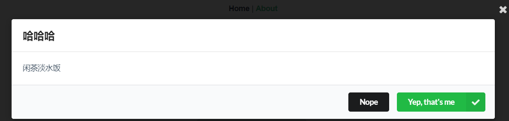

## 目标

向组件库中添加一个弹窗组件



目标：

- 允许用户传入自定义的标题和内容
  - 简单文本
  - 插槽
- 允许用户传入按钮文案
- 允许用户控制显示或者隐藏
- 抛出处理事件

## 基本素材

下面的代码会产生一个弹出框

```html
<div class="ui dimmer modals page active">
      <div class="ui standard modal active" style="top: 60px;">
        <i class="close icon" @click="hNo"></i>
        <div class="header">
             头部 
        </div>
        <div class="content">
          <div class="description">
           内容
          </div>
        </div>
        <div class="actions">
          <div class="ui black button">Nope</div>
          <div class="ui positive right labeled icon button">
            Yep, that's me
            <i class="checkmark icon"></i>
          </div>
        </div>
      </div>
 </div>
```

通过控制 active类可以关闭或者隐藏效果：有active就会显示弹窗，没有active就不会显示

## 实现基本功能

### 实现父组件 v-model的功能

```html
<template>
<!--semantic-ui中约定的： 如果有active类，则会显示 -->
  <div class="ui dimmer modals page" :class="{'active':isShow}">
    <div class="ui standard modal" :class="{'active':isShow}" style="top: 60px;">
      <i class="close icon" @click="hClose"></i>
      <div class="header">
            头部
      </div>
      <div class="content">
        <div class="description">
          内容
        </div>
      </div>
      <div class="actions">
        <div class="ui black button">Nope</div>
        <div class="ui positive right labeled icon button">
          Yep, that's me
          <i class="checkmark icon"></i>
        </div>
      </div>
    </div>
 </div>
</template>

<script>
export default {
  name: 'MyDialog',
  props: {
    // 通过父组件中v-model传入
    value: {
      type: Boolean,
      required: false,
      default: false
    }
  },
  data () {
    return {
      // 由于后期要修改显示/隐藏，我们不能直接在prop中修改，所以这里添加一个数据项 isSHow
      isShow: this.value
    }
  },
  methods: {
    hClose () {
      // 关闭
      this.isShow = false
      // 修改父组件中v-model的值
      this.$emit('input', this.isShow)
    }
  },
  watch: {
    // 监视属性的变化
    // 父级组件中的v-model="abc"，如果abc的变化了，在子组父内部如何得知？
    value () {
      console.log('v-model的值变化了', this.value)
      // 更新子组件内部的状态
      this.isShow = this.value
    }
  }
}
</script>
```


测试代码：

```
<template>
  <div>

    <h1>测试my-dialog</h1>
    <button type="primary" @click="isShow = !isShow">切换显示</button>
    <my-dialog v-model="isShow">

    </my-dialog>
  </div>
</template>

<script>
export default {
  name: 'PageDialog',
  data () {
    return {
      isShow: false
    }
  }
}
</script>
```


## 参考代码

### 组件

```javascript
<template>
  <div class="ui dimmer modals page " :class="cWarpClass">
    <div class="ui standard modal" :class="cBoxClass" style="top: 60px;">
      <i class="close icon" @click="hNo"></i>
      <div class="header">
          <slot name="header">{{title}}</slot>
      </div>
      <div class="content">
        <div class="description">
          <slot name="body">{{content}}</slot>
        </div>
      </div>
      <div class="actions">
        <div class="ui black button" @click="hNo">{{noTxt}}</div>
        <div class="ui positive right labeled icon button" @click="hYes">
          {{yesTxt}}
          <i class="checkmark icon"></i>
        </div>
      </div>
    </div>
 </div>
</template>
<script>
export default {
  name: 'MyDialog',
  props: {
    value: {
      type: Boolean,
      default: false
    },
    title: {
      type: String,
      default: '系统提示',
      require: false
    },
    content: {
      type: String,
      default: '时间不多了',
      require: false
    },
    noTxt: {
      type: String,
      default: '取消',
      require: false
    },
    yesTxt: {
      type: String,
      default: '确定',
      require: false
    }
  },
  computed: {
    cWarpClass () {
      if (this.active) {
        return 'active'
      }
      return ''
    },
    cBoxClass () {
      if (this.active) {
        return 'active'
      }
      return ''
    }
  },
  data () {
    return {
      active: false
    }
  },
  watch: {
    value: {
      handler (newVal, oldVal) {
        console.log(newVal, oldVal)
        this.active = this.value
      },
      immediate: true
    }
  },
  methods: {
    hClose () {
      this.active = false
      this.$emit('input', this.active)
    },
    hNo () {
      this.hClose()
      this.$emit('no')
    },
    hYes () {
      this.hClose()
      this.$emit('yes')
    }
  }
}
</script>
```

## 测试示例

```html
<my-dialog v-model="show"
    title="哈哈哈"
    content="闲茶淡水饭"
    @no="hNo"
    @yes="hYes">
    <div slot="body">
      <p>这里我的是内容</p>
      <p>这里我的是内容</p>
      <p>这里我的是内容</p>
      <p>这里我的是内容</p>
    </div>
</my-dialog>
```

